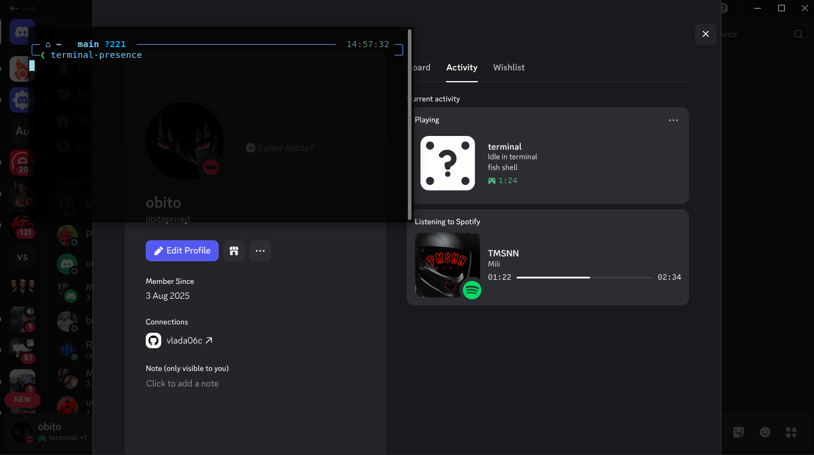
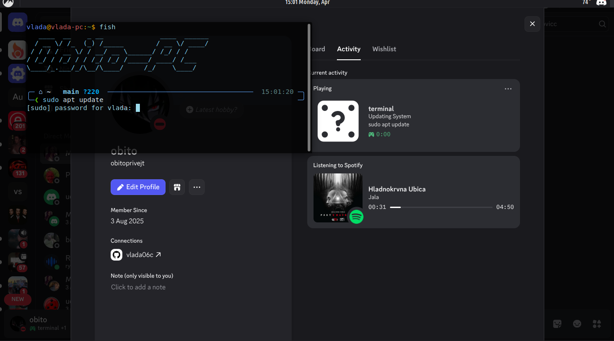
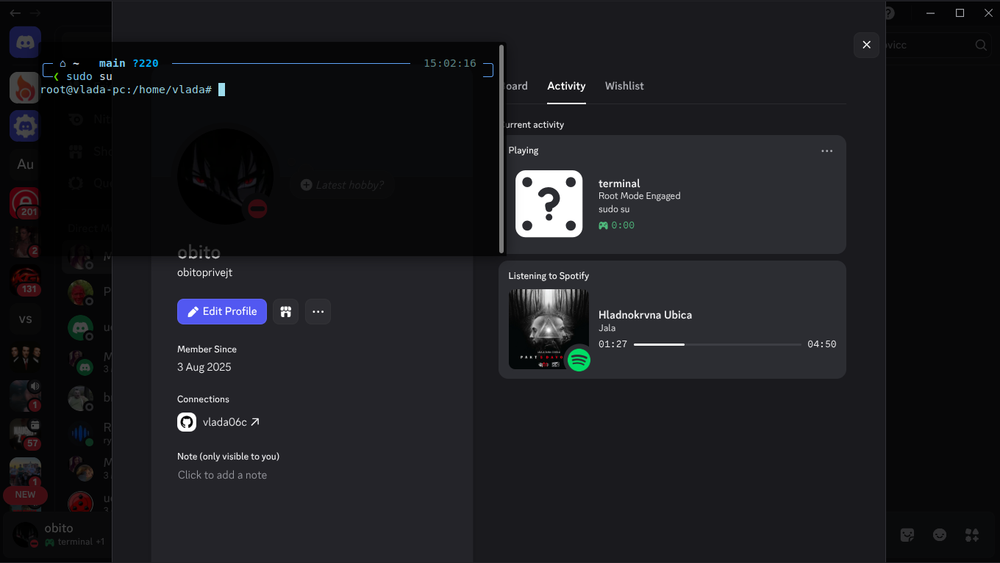
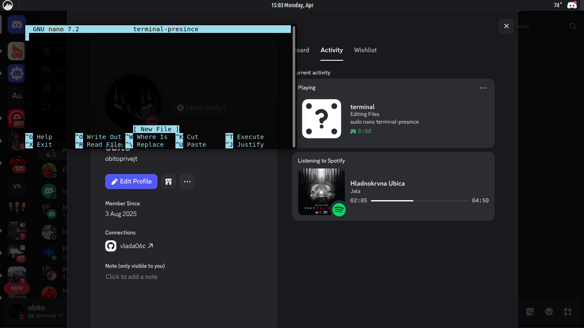

# terminal-presence

Small Python script that updates Discord Rich Presence from terminal activity.

## Quick Install

Clone the repo and run the installer. It auto-detects the project path from `install.sh`, lets you override it manually, asks for your Discord Client ID, detects `bash`/`zsh`/`fish`, adds the correct `source` line, creates `.venv`, installs requirements, and registers the user `systemd` service with the right paths.

```bash
git clone <your-repo-url> terminal-presence
cd terminal-presence
chmod +x install.sh
./install.sh
```

After the script finishes:

```bash
exec $SHELL -l
systemctl --user status terminal-presence.service
```

## Step-by-Step Setup

### 1. Create your Discord application and copy the Client ID

Open `https://discord.com/developers/applications`, create or open your app, then copy the **Application ID** from **General Information**. The installer will save it into `.env` as:

```dotenv
CLIENT_ID="your_discord_app_id"
```

You can also use `CLIENT_ID`, `DISCORD_CLIENT_ID`, or `TERMINAL_PRESENCE_CLIENT_ID` as environment variables, but `install.sh` writes `.env` automatically.

### 2. Clone the repo

```bash
git clone <your-repo-url> terminal-presence
cd terminal-presence
```

### 3. Run the installer

```bash
./install.sh
```

The installer will ask:

1. Where the repo is located. Press `Enter` to use the auto-detected directory from `install.sh`, or type a different path to override it.
2. What your Discord Client ID is.

Then it will automatically:

1. Create or reuse `./.venv`
2. Run `pip install -r requirements.txt`
3. Write `.env`
4. Detect your shell
5. Add a managed hook block to `~/.bashrc`, `~/.zshrc`, or `~/.config/fish/config.fish`
6. Render the user `systemd` service with your final absolute repo path
7. Run `systemctl --user daemon-reload`
8. Run `systemctl --user enable --now terminal-presence.service`

### 4. Restart your shell

```bash
exec $SHELL -l
```

The installed hook now uses `TERMINAL_PRESENCE_DIR`, so it does not depend on a hardcoded `~/Desktop/...` path. The managed block looks like this for `bash`/`zsh`:

```bash
export TERMINAL_PRESENCE_DIR="/absolute/path/to/terminal-presence"
source "$TERMINAL_PRESENCE_DIR/shell-hooks/terminal_presence.bash"
```

Fish example:

```fish
set -gx TERMINAL_PRESENCE_DIR "/absolute/path/to/terminal-presence"
source "$TERMINAL_PRESENCE_DIR/shell-hooks/terminal_presence.fish"
```

### 5. Verify that it is running

Make sure the Discord desktop app is open, then run a few commands in a new terminal:

```bash
systemctl --user status terminal-presence.service
tail -f ~/.log/terminal-presence.log
```

Default status file:

```text
/tmp/terminal_presence_status
```

Default log file:

```text
~/.log/terminal-presence.log
```

## Screenshots And Examples

### 1. Idle in terminal



### 2. Package update example

Command:

```bash
sudo apt update
```

Result:



### 3. Root shell example

Command:

```bash
sudo su
```

Result:



### 4. File editing example

Command:

```bash
nano README.md
```

Result:



## Optional Config

If you want custom command mappings or different Discord asset labels:

```bash
cp config.json.example config.json
```

Example:

```json
{
  "custom_commands": [
    {
      "pattern": "pytest",
      "details": "Running Tests",
      "state": "{command}"
    },
    {
      "pattern": "ssh user@host",
      "details": "Remote Access",
      "state": "{command}"
    }
  ]
}
```

Supported custom rule fields:

1. `pattern`: text or regex to match
2. `details`: Discord details text
3. `state`: Discord state text, supports `{command}`, `{shell_name}`, `{os_name}`
4. `match`: optional, one of `contains`, `exact`, `regex`
5. `case_sensitive`: optional boolean

If you want a different status file path, set `TERMINAL_PRESENCE_STATUS_FILE` in your shell and use the same path in `config.json`.

## Manual Run

```bash
./.venv/bin/python terminal_presence.py
```

## Troubleshooting

If the service does not start correctly:

```bash
systemctl --user status terminal-presence.service --no-pager -l
cat ~/.config/systemd/user/terminal-presence.service
tail -f ~/.log/terminal-presence.log
```

## Requirements

1. Linux
2. Discord desktop app running
3. Python 3
4. `systemd --user`
